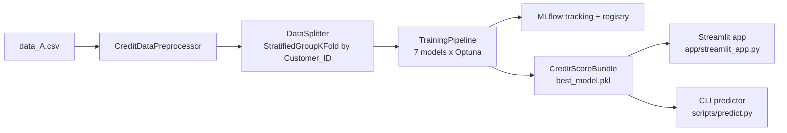
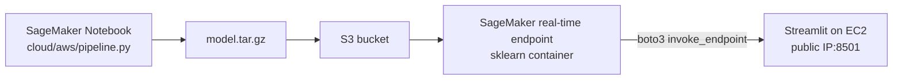
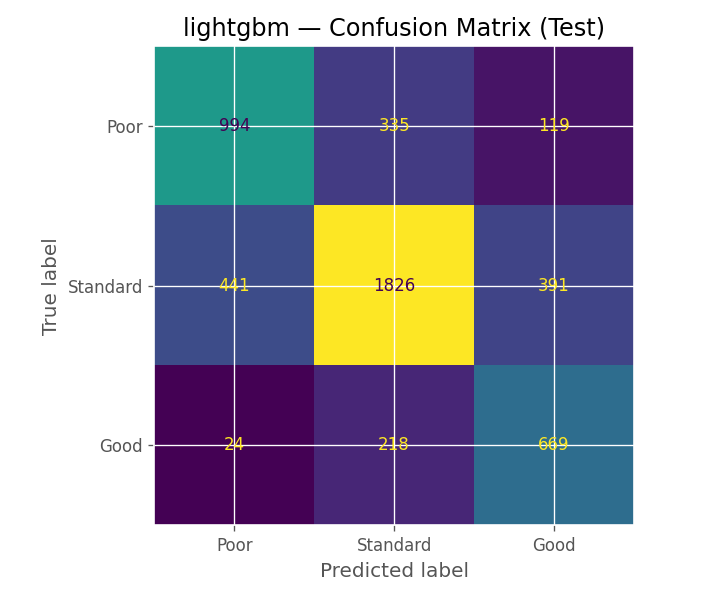
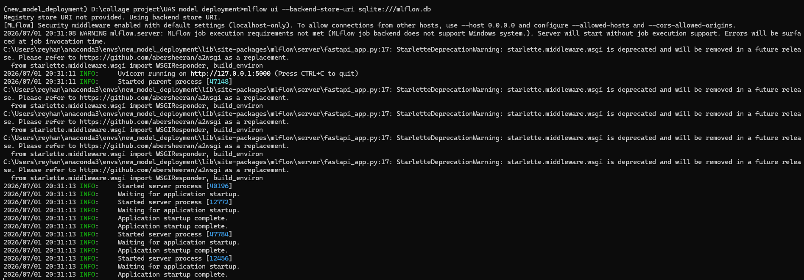
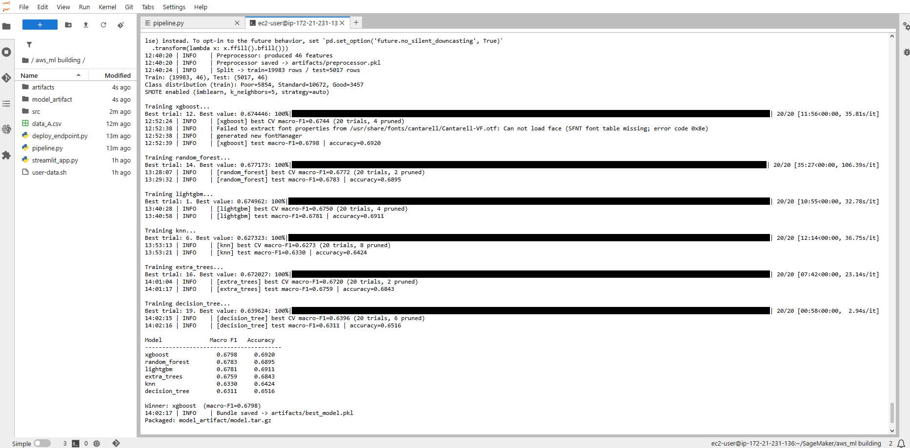
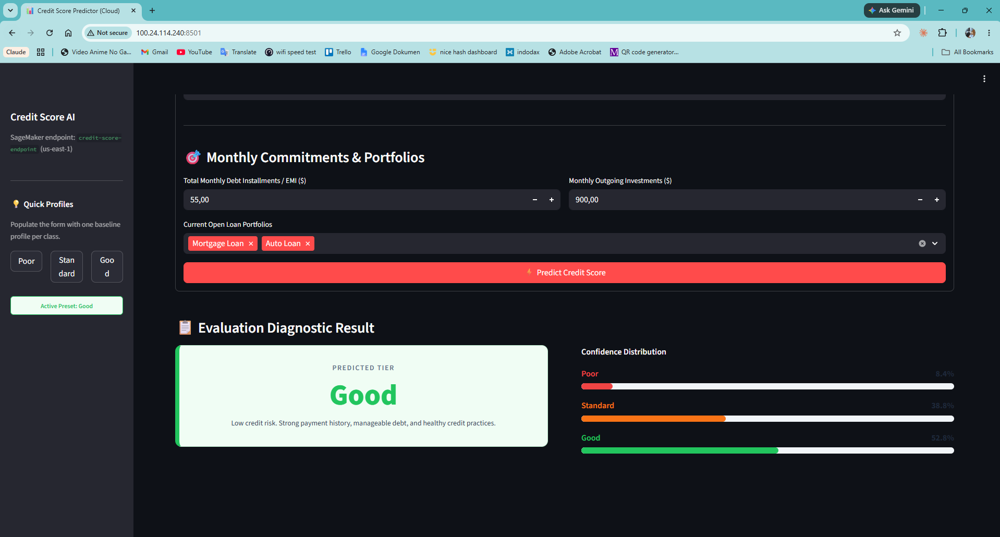

# Credit Score MLOps

End-to-end, leakage-safe credit-score classification: an OOP training pipeline
tracked with MLflow and tuned with Optuna, served locally via Streamlit, and
deployed to AWS (S3, a SageMaker real-time endpoint, and an EC2-hosted
Streamlit front end).

## Contents

- [Problem](#problem)
- [Architecture](#architecture)
- [Data & preprocessing](#data--preprocessing)
- [Modeling & tuning](#modeling--tuning)
- [Results](#results)
- [Leakage prevention](#leakage-prevention)
- [Deployment](#deployment)
- [Challenges & fixes](#challenges--fixes)
- [Local vs. cloud](#local-vs-cloud)
- [How to run](#how-to-run)
- [Project structure](#project-structure)
- [Future work](#future-work)
- [Acknowledgements](#acknowledgements)

## Problem

A financial institution wants to segment customers into three credit-score
tiers, `Poor`, `Standard`, and `Good`, from monthly account and behavior
records: income, bank accounts, credit cards, payment delays, credit mix,
loan types, and so on. It's a 3-class classification problem on an imbalanced
dataset (the `Good` class is only about 17-19% of rows), so **macro-F1** is
the primary metric instead of plain accuracy. Macro-F1 forces the model to do
well on every class, not just the majority one.

## Architecture

**Local:**



**Cloud (AWS):**



## Data & preprocessing

The data is a subset of the public Kaggle "Credit Score Classification"
dataset: 25,000 noisy rows of synthetic customer records across several
months per customer. It isn't committed here, partly because the
redistribution license isn't clear and partly because it carries
Name/SSN-shaped columns even though the underlying data is synthetic. See
[`data/README.md`](data/README.md) for how to get it.

`CreditDataPreprocessor` (in [`pipeline.py`](pipeline.py)) turns 23 raw
columns into **46 features**:

- Placeholder stripping (`_______` becomes NaN, say) and range fixes (an
  `Age` of 8466 also becomes NaN).
- `"20 Years and 5 Months"` turns into a single numeric months value.
- **Per-customer imputation.** Each `Customer_ID` has several monthly rows,
  so a null value is filled by borrowing another row from the same customer
  first, falling back to median/mode or KNN imputation only after that.
- 5th/95th percentile capping for outliers.
- `Payment_Behaviour` splits into two ordinal features, `Spend_Level` and
  `Payment_Value`.
- `Type_of_Loan` expands into 9 one-hot `Has_*` loan flags.
- `Occupation` expands into 15 one-hot columns.
- Only identifier columns get dropped (`ID`, `Name`, `SSN`). `Customer_ID` is
  kept for leakage-safe splitting but excluded from the model's feature list.

## Modeling & tuning

There are 7 model families, each a `BaseModel` subclass with its own `build`,
`default_params`, and Optuna `search_space`: XGBoost, Random Forest, LightGBM,
KNN, Extra Trees, Decision Tree, and SVM.

Tuning runs on an Optuna TPE sampler with a `MedianPruner` that prunes weak
trials per CV fold, warm-started from each model's default params. Studies
persist to SQLite, so tuning resumes across runs, and parallel trials
throttle each model's `n_jobs` automatically to avoid oversubscribing the
CPU. XGBoost and LightGBM get early stopping through a customer-grouped
hold-out, so `n_estimators` works as an upper bound rather than a fixed
count. Class imbalance is handled with SMOTE oversampling, applied only
inside each training fold and never on validation or test data.

Everything is tracked in MLflow (SQLite backend), one run per model, with a
model registry and a champion guard: a new run only overwrites the saved
model if its macro-F1 strictly beats the current champion.

## Results

Held-out test set, 5,017 rows, customer-grouped, never seen during tuning:

| Model | Accuracy | Macro-F1 |
|---|---|---|
| **LightGBM (champion)** | 0.695 | **0.683** |
| Random Forest | 0.693 | 0.681 |
| XGBoost | 0.696 | 0.679 |
| Extra Trees | 0.686 | 0.676 |
| Decision Tree | 0.684 | 0.675 |
| KNN | 0.641 | 0.631 |

Per-class F1 for the champion (LightGBM):

| Class | Precision | Recall | F1 | Support |
|---|---|---|---|---|
| Poor | 0.681 | 0.686 | 0.684 | 1,448 |
| Standard | 0.768 | 0.687 | 0.725 | 2,658 |
| Good | 0.567 | 0.734 | 0.640 | 911 |



0.68 macro-F1 is an honest number, not an inflated one. It's noticeably lower
than the 0.85+ scores people post for this Kaggle dataset using a plain
random row-split, and that's because those splits leak: the same customer's
rows end up in both train and test, so the model partly memorizes customers
instead of learning general patterns. Every split here is grouped by
`Customer_ID` instead, which is a harder, more realistic evaluation.

## Leakage prevention

Splits are grouped by `Customer_ID`, never done row by row, so no customer
appears in both train and test (`StratifiedGroupKFold`). SMOTE only runs
inside the training fold, during both Optuna CV and the final fit, and never
touches validation or test data. The early-stopping hold-out carved out of
the training set for XGBoost and LightGBM is also customer-grouped, so no
customer spans both the fit and eval portions.

## Deployment

**Local:** a self-contained `CreditScoreBundle` pickle bundles the fitted
preprocessor, model, ordered feature list, and label names together, so
training and inference always go through the same preprocessing. Two front
ends load it: [`app/streamlit_app.py`](app/streamlit_app.py), a 23-field form
with Poor/Standard/Good preset buttons and per-class probability bars, and
[`scripts/predict.py`](scripts/predict.py), a CLI with `--selftest`,
`--input CSV`, and `--json` modes.

**Cloud (AWS):** the same model, packaged and deployed via
[`cloud/aws/`](cloud/aws/README.md). `model.tar.gz` goes to S3, then a
SageMaker real-time endpoint (a prebuilt sklearn container) serves it, and an
EC2 instance runs the Streamlit UI, calling the endpoint over `boto3`. This
was verified end-to-end: the endpoint was `InService` and the EC2-hosted app
was reachable at its public IP, tested with one case per class.

| MLflow tracking UI | AWS SageMaker endpoint live | Streamlit on EC2 |
|---|---|---|
|  |  |  |

*(The AWS Academy Learner Lab account behind these screenshots is a temporary
training sandbox and has since expired, so the endpoint and EC2 instance
aren't live anymore. See [Local vs. cloud](#local-vs-cloud) for why a live
AWS demo isn't kept running long-term.)*

## Local vs. cloud

| | Local (Streamlit) | Cloud (S3 → SageMaker → EC2) |
|---|---|---|
| Setup effort | Minutes | Hours (IAM roles, endpoint config, security groups) |
| Cost | Free | Pay-per-use (endpoint + EC2 instance) |
| Public access | No, only runs on one machine | Yes, public IP, anyone can reach it |
| Scalability | None, single process | Endpoint can scale independently of the UI |
| Iteration speed | Fast, edit and rerun instantly | Slower: repackage, redeploy, wait for the endpoint |
| Production fit | Good for demos and dev | Closer to how a real institution would separate model-serving from the UI layer |

## How to run

```bash
# 1. Set up the environment (Python 3.10)
pip install -r requirements.txt

# 2. Get the dataset (see data/README.md) and place it at data/data_A.csv

# 3. Train (writes artifacts/ and logs to MLflow)
python pipeline.py --data data/data_A.csv --n-trials 30
# smoke test without tuning:
python pipeline.py --data data/data_A.csv --n-trials 0

# 4. View experiments
mlflow ui --backend-store-uri sqlite:///mlflow.db

# 5. Predict from the CLI
python scripts/predict.py --selftest

# 6. Run the local web app
streamlit run app/streamlit_app.py
```

Cloud deployment steps are in [`cloud/aws/README.md`](cloud/aws/README.md).

Run the test suite, which checks the preprocessor's output shape and that
the bundle predicts correctly on 3 known-class records:

```bash
pytest tests/
```

## Project structure

```
credit-score-mlops/
├── README.md
├── LICENSE
├── requirements.txt
├── pipeline.py                  # OOP, MLflow-tracked training pipeline
├── data/README.md               # dataset source + download instructions
├── notebooks/                   # EDA, cleaning, baseline model
├── scripts/predict.py           # CLI inference
├── app/streamlit_app.py         # local Streamlit web app
├── artifacts/                   # trained bundle, preprocessor, reports, plots
├── cloud/aws/                   # SageMaker + EC2 deployment
├── docs/images/                 # screenshots referenced above
└── tests/                       # pytest smoke tests
```

## Future work

- Package `pipeline.py`'s classes into a proper `src/credit_score/` module
  shared between the local and cloud code paths. They're currently
  duplicated, since the two were built at different points in the project,
  and unifying them would also remove the `__main__` pickle-remapping hack.
- Re-deploy a live demo (Streamlit Community Cloud or Hugging Face Spaces)
  now that the AWS Academy sandbox has expired.
- Add SHAP-based feature-importance explanations to the Streamlit prediction
  card.

## Acknowledgements

- Dataset: a subset of the public Kaggle "Credit Score Classification"
  dataset.
- The cloud folder structure was adapted from an instructor-provided
  SageMaker "Wine Quality" demo, retargeted to this project's real
  preprocessing, models, and bundle format.
- Originally built as the final project for *Model Deployment* (DTSC6012001)
  at BINUS University.
